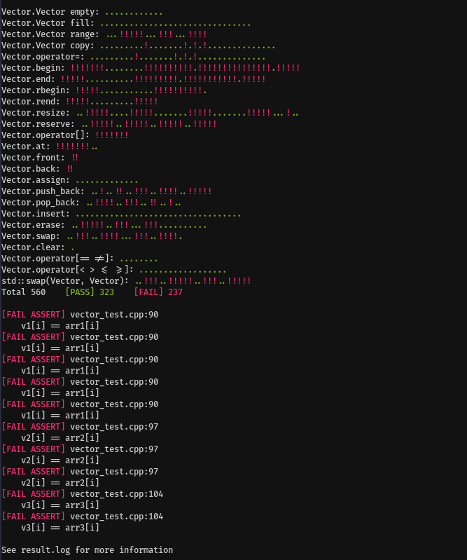

# ft_containers test

Unit test for the ft_containers project of school 42.



# Usage

Clone this repository such that:

```
.
|- ft_containers
|- ft_containers_test
```

Or change `FT_CONTAINERS_DIR` in the Makefile.

Then `make run`
